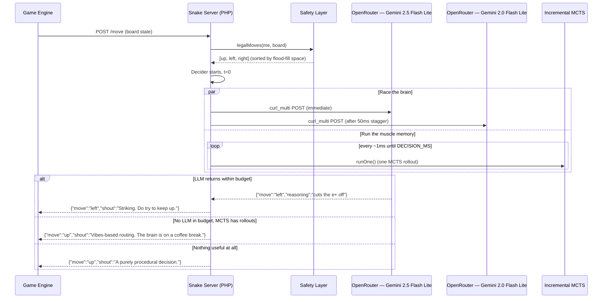

<div align="center">

# Battlesnake vNext

```
     ██████╗  █████╗ ████████╗████████╗██╗     ███████╗███████╗███╗   ██╗ █████╗ ██╗  ██╗███████╗
     ██╔══██╗██╔══██╗╚══██╔══╝╚══██╔══╝██║     ██╔════╝██╔════╝████╗  ██║██╔══██╗██║ ██╔╝██╔════╝
     ██████╔╝███████║   ██║      ██║   ██║     █████╗  ███████╗██╔██╗ ██║███████║█████╔╝ █████╗
     ██╔══██╗██╔══██║   ██║      ██║   ██║     ██╔══╝  ╚════██║██║╚██╗██║██╔══██║██╔═██╗ ██╔══╝
     ██████╔╝██║  ██║   ██║      ██║   ███████╗███████╗███████║██║ ╚████║██║  ██║██║  ██╗███████╗
     ╚═════╝ ╚═╝  ╚═╝   ╚═╝      ╚═╝   ╚══════╝╚══════╝╚══════╝╚═╝  ╚═══╝╚═╝  ╚═╝╚═╝  ╚═╝╚══════╝
                                                ██╗   ██╗███╗   ██╗███████╗██╗  ██╗████████╗
                                                ██║   ██║████╗  ██║██╔════╝╚██╗██╔╝╚══██╔══╝
                                                ██║   ██║██╔██╗ ██║█████╗   ╚███╔╝    ██║
                                                ╚██╗ ██╔╝██║╚██╗██║██╔══╝   ██╔██╗    ██║
                                                 ╚████╔╝ ██║ ╚████║███████╗██╔╝ ██╗   ██║
                                                  ╚═══╝  ╚═╝  ╚═══╝╚══════╝╚═╝  ╚═╝   ╚═╝
```

***A third-generation Battlesnake competitor from the Mann lab.***
*Built in PHP 8.3. Verified to decide a move in 150 ms. Two trophies on the shelf and counting.*

[](https://github.com/ericmann/battlesnake-next/actions/workflows/ci.yml)
[](https://www.php.net/)
[](https://github.com/ericmann/battlesnake-next/releases)
[](./LICENSE)
[](./tests)

</div>

---

> **Genus:** *Serpens elegantissima*
> **Habitat:** PHP-Fpm. Conference WiFi. Cloudflare Tunnels.
> **Diet:** Hexagonal pellets. Smaller snakes. The hopes of the bracket.
> **Conservation status:** Apex.

The previous two animals in this lineage have a perfect record at PHP
conferences — the v1 specimen swept Cascadia PHP, the v2 specimen swept
PHP Tek (with v1 finishing as runner-up, because of course it did). This
one is built to continue the streak. It has opinions about your snake.
They are not generous opinions.

If you are reading this and your snake is **not** a third-generation
PHP-fpm-and-curl-multi competitor with a dual-LLM racing brain and a
flood-fill safety net... well. It was a good run.

### What the snake actually sees

Mid-game, mid-tournament, mid-decision — this is the world the snake
gets handed every 500 ms:

```
10│ .  .  .  .  .  .  .  .  .  .  .         ┌──────────────────────────────┐
 9│ .  .  .  .  .  .  .  .  .  .  .         │ Turn 47   Health 32   Len 6  │
 8│ .  .  F  .  .  .  .  .  s  s  t         │                              │
 7│ .  .  .  .  .  .  .  .  e+ .  .         │ Legal moves (sorted by space)│
 6│ .  .  .  .  H  .  .  .  .  .  .         │   1. up                      │
 5│ .  .  e- .  B  F  .  .  .  .  .         │   2. right                   │
 4│ .  .  s  .  B  B  B  .  .  .  .         │   3. left                    │
 3│ .  .  s  s  .  .  T  .  .  .  .         │                              │
 2│ X  X  .  s  .  .  .  .  .  .  .         │ Strategy : MCTS              │
 1│ X  X  .  s  s  t  .  .  .  F  .         │ Rollouts : 2,214             │
 0│ X  X  .  .  .  .  .  .  .  .  .         │ Latency  : 150 ms            │
   └─────────────────────────────────        └──────────────────────────────┘
     0  1  2  3  4  5  6  7  8  9  10
```

`H` is the snake's head, `B` its body, `T` its tail. `e+` / `e=` / `e-`
are enemy heads tagged by length relative to ours: kill, mutual death,
or run away. `F` is food, `X` is hazard sauce, `.` is open space.

The y-axis is flipped on render so up on the page is up on the board —
matches how a human (or a language model) reads a grid.

---

> ### Current brain: Llama on Groq, racing against itself
>
> The first attempt routed to Google Vertex EU at ~500 ms p50 — already
> at the Battlesnake budget. Disabling the LLM path looked inevitable
> until we tried Groq-hosted Llama via OpenRouter's strict provider
> pinning (`provider.allow_fallbacks = false`). The numbers came back
> clean:
>
> | Model                                  | p50    | p95    |
> |----------------------------------------|--------|--------|
> | `meta-llama/llama-3.3-70b-instruct`    | 349 ms | 419 ms |
> | `meta-llama/llama-3.1-8b-instruct`     | 320 ms | 560 ms |
>
> Counter-intuitive but real: the **70B model is faster than the 8B**
> on Groq, because the bottleneck is end-to-end round trip rather than
> token generation, and the 70B's reasoning is qualitatively better
> (it correctly chases food at low health where the 8B chases space).
>
> So the live config: **primary = 70B, secondary = 8B, both pinned to
> Groq**. The Decider runs them in parallel with MCTS rollouts during
> the curl_multi idle window, picks LLM > MCTS > flood-fill at the
> deadline.

---

## What you are looking at

A 500-line PHP 8.3 server that responds to Battlesnake's `/move` endpoint
within the engine's 500ms budget — every time, on every board, on every
network. It does this by running **three decision strategies inside a single
time window** and picking the best signal it has at the deadline:

1. **Live LLM inference** (the primary brain) — two models on
   [OpenRouter](https://openrouter.ai) raced against each other via
   `curl_multi`. The first one to return a legal move wins.
2. **Incremental MCTS** (the muscle memory) — random rollouts that run
   *in the same poll loop* the LLM is waiting in. Hundreds of them per turn.
   Even when the LLM wins, the MCTS has already done its homework.
3. **Flood-fill winner** (the spinal reflex) — the safety layer's
   most-open-space direction. Pre-computed before the loop even starts.
   Always available. Zero additional latency. The snake does not fall over
   if the internet does.

At `DECISION_MS` (default 450ms) the loop stops, the priorities resolve
(LLM → MCTS → flood-fill), and a single JSON response goes out the door.
A separate log line tells the operator which strategy won and how long
each piece took.



## The design philosophy, narrated by an Australian zoologist

> "What you're seeing here, mate, is a creature that *refuses* to lose to a
> dropped TCP packet. Most snakes — beautiful animals, very impressive,
> perfectly competent at the game — they hand their entire decision off to
> the network and pray. Not this one. This one has a backup brain in a
> backup brain. Watch."

Every turn, three different decision processes are running at the same
time. The LLM is doing its thing in the cloud. MCTS is rolling out random
futures on the local CPU. The flood-fill winner is sitting there, already
computed, just in case. None of them are blocking the others. None of them
are wasting the others' time. When the deadline arrives, the snake reaches
into its pocket, pulls out the best result it has, and moves.

> "And here's the *brilliant* bit — even when the LLM wins, the MCTS has
> still done about three hundred rollouts in parallel. *Three hundred*
> simulated futures. The snake didn't waste a millisecond. Look at that
> tail flick. That's confidence, that is."

---

## Lineage

| Generation | Year | Approach | Result |
|---|---|---|---|
| **v1** ([github](https://github.com/ericmann/battlesnake)) | 2024 | Hand-tuned heuristic scoring (food distance, tail chase, flood-fill, head-on avoidance) | **Won** Cascadia PHP. Swept the bracket. |
| **v2** (private repo) | 2025 | v1 + minimax-style trap detection, head-collision economics, board-division penalties | **Won** PHP Tek. v1 finished runner-up. |
| **v3** (this repo) | 2026 | Dual-LLM racing brain over `curl_multi`, MCTS interleaved into the poll loop, flood-fill safety net underneath | *To be determined. By winning.* |

There was a v3 attempt before this one. It tried to train a custom value
function in Python and serve inferences from PHP. It never reached
production because the training data was, in the project's own technical
documentation, "junk." We do not speak of it.

This v3 takes a different approach: instead of training a value function,
*rent* one. Two of them, actually. Race them. Trust no individual model
to beat a 500ms deadline; trust the *fastest of two* to do it most of the
time, and have a real plan for when neither does.

---

## How it actually works

### The four endpoints

```
GET  /         → snake metadata (color, head, tail, author, version)
POST /start    → {} (we don't keep state between turns)
POST /move     → {"move": "...", "shout": "..."}
POST /end      → {} (still don't keep state)
```

`public/index.php` is a 25-line front controller. There is no framework.
There will not be a framework. The match expression is the framework.

### The Decider

`src/Decider.php` is the loop. Given an `LlmDriver` and an
`IncrementalMcts`, it polls one, ticks the other, sleeps a millisecond,
and stops at the deadline. That's it. The class is 60 lines because the
problem, when you describe it correctly, is small.

```php
while (hrtime(true) < $deadline) {
    if ($llmResult === null) $llmResult = $this->llm->step();
    $this->mcts->runOne();
    usleep(1000);
}
```

Anything more clever than this would be a regression.

### The safety layer

`src/Safety.php::legalMoves()` is the seatbelt. It takes the raw
Battlesnake payload, filters out every move that would walk into a wall,
a body segment, or a head-on collision with an equal-or-larger snake,
and returns what remains sorted by flood-fill space (most open space
first). It also handles the **just-eaten tail** rule properly: a snake
that just ate this turn does not vacate its tail next turn, and pretending
otherwise gets you killed in the late game.

`legalMoves()` is *guaranteed non-empty*. Even when the snake is boxed
in and every option is fatal, it returns the least-bad one so the engine
always gets a legal-shaped response. If we're going to die, we're going
to die *gracefully*.

### The board renderer

`src/Board.php::format()` produces the ASCII grid shown at the top of
this README, plus a metadata block listing turn / health / length / head
position / facing direction / pre-filtered legal moves. It exists to
feed the (currently dormant) LLM brain something it can reason about
spatially. The y-axis is flipped on output so up on the page is up on
the board, which dramatically helps both human debugging and any model
asked to interpret the layout.

### The shouts

The Battlesnake game viewer shows a `shout` string under each move.
`src/Shouts.php` keeps a small library of on-brand commentary, indexed
by situation: hunting, attacking, eating, hungry, escaping, cornering,
coiling, cornered, fallback, generic. The Controller infers the situation
from the chosen move and the game state, then picks a line salted by the
turn number so successive turns rotate naturally.

A small selection from the *attacking* pool:

> "Striking. Do try to keep up."
> "Head-on. The shorter snake will not be writing memoirs."
> "A textbook collision in the making. Eight out of ten judges."
> "You weren't using that head, were you?"

The voice is half-NatGeo, half-ESPN, half-Australian-naturalist, all
deadpan. No gen-Z slang. No emoji. The snake has standards.

---

## Quick start

```bash
# 1. Clone and install dependencies
git clone git@github.com:ericmann/battlesnake-next.git
cd battlesnake-next
composer install

# 2. Configure your OpenRouter key
cp .env.example .env
$EDITOR .env  # set OPENROUTER_API_KEY

# 3. Spin it up
docker compose up -d

# 4. Smoke test
curl http://localhost:9595/
curl -X POST http://localhost:9595/move \
  -H 'Content-Type: application/json' \
  -d @tests/Fixtures/sample_board.json
```

The container exposes `127.0.0.1:9595 → :9000` so the existing host
`cloudflared` named tunnel can route `snake.eamann.com` to
`http://127.0.0.1:9595` without colliding with anything else listening
on `:9000`.

### Running the test suite

```bash
composer test
# or, with prettier output:
./vendor/bin/phpunit --testdox tests/
```

51 unit tests, 155 assertions, no network. The OpenRouter race tests
use a `FakeTransport` that replays canned responses with controlled
latencies; the Decider tests use a `FakeLlmDriver` that delivers a
canned `RaceResult` on the Nth `step()`. The whole suite runs in well
under a second.

### Tournament-day latency probe

Before a tournament, run from the venue network:

```bash
php LATENCY_CHECK.php
```

It fires 20 sequential OpenRouter calls with a minimal prompt, prints
p50 / p95 / max, and recommends a tournament-tuned `LLM_TIMEOUT_MS`
based on what it observed. The recommendation is conservative — adds
~200ms slack for the full board prompt and caps at the 500ms Battlesnake
budget minus 50ms safety margin.

---

## Configuration (`.env`)

| Variable | Default | What it does |
|---|---|---|
| `OPENROUTER_API_KEY` | — | Your OpenRouter API key. Snake works without it (pure MCTS + flood-fill), but you bought a Lamborghini for a reason. |
| `PRIMARY_MODEL` | `google/gemini-2.5-flash-lite` | Fastest reliable TTFT we found; almost always wins the race when it wins at all. |
| `SECONDARY_MODEL` | `google/gemini-2.0-flash-lite-001` | Hedge against tail-latency dropouts on the primary. |
| `STAGGER_MS` | `50` | How long after the primary to fire the secondary. |
| `DECISION_MS` | `450` | Hard wall-clock cap on the unified decision loop. Keep ≤ 450 — Battlesnake gives 500. |
| `OPENROUTER_APP_NAME` | `battlesnake-next` | Shown on OpenRouter's leaderboards. |
| `OPENROUTER_REFERER` | `https://snake.eamann.com` | Same. |
| `SNAKE_AUTHOR` / `SNAKE_COLOR` / `SNAKE_HEAD` / `SNAKE_TAIL` | — | Cosmetics. The snake also has standards about its appearance. |

---

## Observability

Every `/move` emits one JSON line on stderr (which Docker captures into
`docker compose logs -f snake`). Sample:

```json
{
  "ts": "2026-05-09T22:18:34.121Z",
  "event": "move",
  "game_id": "tournament-final-game-3",
  "turn": 47,
  "strategy": "llm",
  "model_used": "google/gemini-2.5-flash-lite",
  "model_label": "primary",
  "move": "up",
  "reasoning": "health is low, routing to nearest food at (5,5)",
  "safe_moves": ["up", "right", "left"],
  "llm_latency_ms": 428,
  "mcts_rollouts": 341,
  "total_latency_ms": 453,
  "fallback_used": false,
  "own_health": 32,
  "own_length": 6
}
```

What to grep for during a tournament:

```bash
docker compose logs -f snake | grep '"strategy":"llm"'      # LLM-decided turns
docker compose logs -f snake | grep '"strategy":"mcts"'     # fallback turns
docker compose logs -f snake | grep '"event":"warn"'        # something surprising happened
```

If `total_latency_ms` ever shows north of 470, it is time to lower
`DECISION_MS` and let the venue's network breathe.

---

## File map

```
battlesnake-next/
├── docs/
│   ├── TDD.md                  Full design spec
│   └── CLAUDE.md               Operational build driver
├── public/
│   └── index.php               25-line front controller
├── src/
│   ├── Controller.php          /move pipeline orchestration
│   ├── Decider.php             The interleaved decision loop
│   ├── Decision.php            Value object: strategy + telemetry
│   ├── LlmDriver.php           Interface
│   ├── CurlMultiLlmDriver.php  Production driver (real curl_multi)
│   ├── NullLlmDriver.php       No-API-key fallback
│   ├── IncrementalMcts.php     One rollout per call
│   ├── Safety.php              legalMoves, floodFill, mctsMove, singleRollout
│   ├── Board.php               ASCII rendering for the LLM
│   ├── Prompts.php             SYSTEM constant
│   ├── OpenRouter.php          Body builders + parsers
│   ├── Shouts.php              On-brand commentary library
│   ├── Context.php             Shouts enum
│   ├── Logger.php              JSON lines → stderr → Docker
│   └── Env.php                 Tiny .env reader
├── tests/                      51 unit tests, 155 assertions
├── nginx/default.conf          Cloudflare-friendly keepalive (65s)
├── docker/entrypoint.sh        nginx + php-fpm under tini
├── Dockerfile                  Multi-stage; opcache on; ~80 MB image
├── docker-compose.yml          Binds 127.0.0.1:9595 only
├── LATENCY_CHECK.php           Tournament-day venue probe
└── .github/workflows/ci.yml    PHPUnit + GHCR image push
```

---

## Things this snake will not do

- **Use a framework.** PHP 8.3's built-in routing is a `match` expression.
- **Persist state between turns.** Each `/move` is fully stateless. The board
  is the source of truth.
- **Wait for one strategy at a time.** Sequential decisioning was the v2
  pipeline. v3 races everything in one window.
- **Lose to a dropped TCP packet.** The flood-fill winner is computed
  before the LLM call even starts.
- **Apologize.**

---

## Things this snake will do

- Win.

---

## License

MIT. See [LICENSE](./LICENSE). If your snake adopts these techniques and
wins something, the polite thing to do is buy the original a beer.
