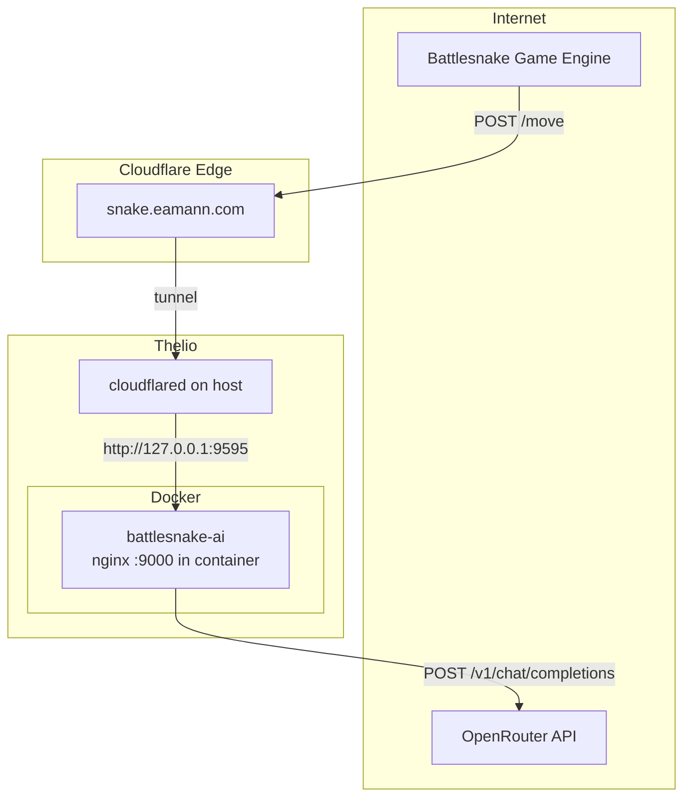
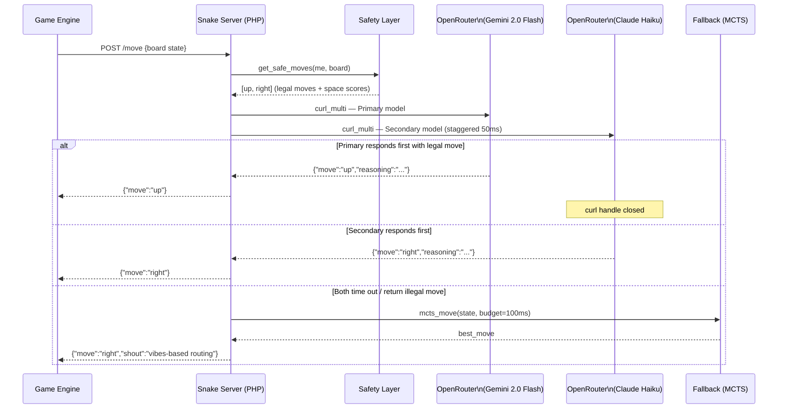
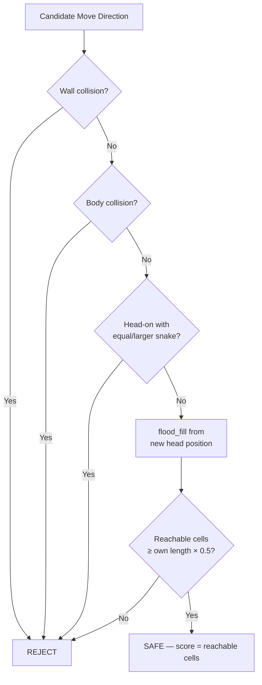

# TDD: Battlesnake AI — PHP + OpenRouter Racing Brain

**Author:** Eric Mann / Displace Technologies  
**Date:** 2026-05-08  
**Version:** 1.0  
**Deployment Target:** Thelio (System76, RTX 5060 Ti) — snake in Docker; Cloudflare Tunnel via `cloudflared` on the host (not a Compose sidecar)  
**Public Endpoint:** `https://snake.eamann.com`

---

## 1. Introduction

This document specifies the design and implementation of a third-generation Battlesnake
competitor. The prior two versions used hand-crafted heuristic scoring functions. This version
replaces the scoring function with a live LLM inference call to OpenRouter, racing two models
simultaneously to stay within Battlesnake's 500ms response window. A flood-fill safety layer
and lightweight MCTS fallback guarantee a legal move is always returned even if both LLM calls
fail or time out.

**In scope:**
- PHP 8.3+ Battlesnake server implementing the full `/`, `/start`, `/end`, `/move` API
- OpenRouter integration with dual-model racing via `curl_multi`
- Board serialization to ASCII grid for LLM consumption
- Flood-fill illegal-move filter and space-scoring fallback
- Lightweight MCTS fallback (budget: 100ms)
- Docker container deployment on Thelio
- Public URL `snake.eamann.com` via an existing Cloudflare named tunnel (`cloudflared` on the host); map the tunnel to `http://127.0.0.1:9595` when you go live (host port reserved for this snake)
- PHPUnit test suite

**Out of scope:**
- Training or fine-tuning any model
- Multi-game state tracking (each `/move` is stateless)
- Web UI or dashboard
- Automatic model benchmarking / A-B rotation

**Related:**
- Prior v1 snake: https://github.com/ericmann/battlesnake (cloned to ~/Projects/battlesnake)
- Prior v2 snake: https://git.dropbear-pike.ts.net/ericmann/battlesnake-v2 (cloned to ~/Projects/battlesnake-v2)
- Unlaunched v3 snake attempt: https://git.dropbear-pike.ts.net/ericmann/battlesnake-v3 (cloned to ~/Projects/battlesnake-v3)
- Battlesnake API spec: https://docs.battlesnake.com/api

---

## 2. Context

### Current State

The existing Battlesnake implementations are PHP applications with a hand-coded scoring
function that evaluates candidate moves using weighted heuristics (distance to food, tail
chase, space counting, head-to-head avoidance). The weights were tuned manually over two
competition seasons. The snakes win on execution speed and solid defensive play but exhibit
recognizable blind spots: they do not pursue head-to-head kills on smaller snakes, they
do not cut off enemies, and they occasionally walk into shrinking corridors.

Both prior versions used similar board serialization modules. The v3 attempt was trying 
to train on various board states to help the snake identiy the "best" next move using 
pre-trained models, splitting the training between Python and the runtime logic with PHP. 
It was never actually lauched or tested in production as the training step was ... junk.

### Target State

A PHP Battlesnake server where the move decision is made by an LLM seeing the full board
state as an ASCII grid. The LLM can reason about spatial relationships, multi-move sequences,
and threat identification. A safety layer ensures the LLM can never return an instantly
fatal move. A fallback chain (MCTS → flood-fill winner) ensures a legal move is returned
even if OpenRouter is unreachable or too slow.

### Human Actors

- **Competitor (1 user):** Registers the snake URL with the Battlesnake tournament bracket,
  monitors terminal logs during games, adjusts model/timeout config between rounds.

### System Interactions

| System | Integration |
|---|---|
| Battlesnake Game Engine | Inbound HTTP POST to `/move`, expects JSON response ≤ 500ms |
| OpenRouter API | Outbound HTTPS POST, OpenAI-compatible, streamed or non-streamed |
| Cloudflare Tunnel (`cloudflared`) | Runs on Thelio host (already configured); point ingress at `http://127.0.0.1:9595` (host → container `9595:9000`) when exposing the stack |
| Tailscale | Network layer on Thelio for remote SSH management from Chicago |

---

## 3. Architectural Diagrams

### 3.1 System Context



### 3.2 /move Request Sequence



### 3.3 Safety Layer — Flood Fill



---

## 4. Non-Functional Requirements

### Availability
- Snake server must respond within 450ms (leaving 50ms margin for network) during active
  tournament games.
- Graceful degradation: if OpenRouter is unreachable, fall through to MCTS → flood-fill
  without error. The server never returns HTTP 5xx to the game engine.
- Health check: `GET /` returns 200 with snake metadata; used by Cloudflare health monitoring.
- RTO: restart via `docker compose restart snake` — target < 30 seconds.

### Performance
- **p50 `/move` response:** < 200ms (LLM path succeeds)
- **p95 `/move` response:** < 420ms (LLM path succeeds on slower WiFi)
- **p99 `/move` response:** < 450ms (fallback path)
- php-fpm worker pool: minimum 4 workers to handle concurrent games
- curl_multi polling loop: 5ms sleep interval, max 300ms total wall time

### Scalability
- Single-host deployment on Thelio is sufficient; Battlesnake tournaments run ≤ 8 concurrent
  games maximum.
- php-fpm `pm.max_children = 16` provides headroom.

### Durability
- OpenRouter HTTP errors (4xx, 5xx, network timeout): silently fall through to fallback.
- LLM returns unparseable JSON: fall through to fallback.
- LLM returns an illegal move: fall through to fallback (do not trust blindly).
- No state is written to disk; each `/move` is fully stateless.

### Deployment
- Single `docker compose up -d` from Thelio (or via Tailscale SSH from Chicago).
- Image built locally on Thelio: `docker compose build`.
- No CI/CD required for a hackathon; rebuild is < 60 seconds.
- Rollback: `docker compose down && git checkout HEAD~1 && docker compose up -d`.

### Data Integrity & Retention
- `OPENROUTER_API_KEY` stored in `.env` file, not committed to git.
- Structured JSON request/response logging to stdout (captured by Docker).
- No PII. No persistent storage. No database.
- Input validation: all `/move` payloads validated against the Battlesnake schema before
  processing; malformed payloads return `{"move":"up"}` immediately.

### Analytics & ETL
- Structured log lines (JSON) for every `/move` call:
  `{turn, model_used, move, reasoning_snippet, llm_latency_ms, total_latency_ms, fallback_used}`
- Logs accessible via `docker compose logs -f snake` over Tailscale SSH from Chicago.
- No external metrics sink required.

### Technical Debt
- **Debt being addressed:** Replaces manual heuristic weight tuning with LLM reasoning.
- **Acceptable new debt:**
  - MCTS fallback uses random rollouts (not learned value function) — sufficient for a fallback.
  - System prompt is not version-controlled with the game logic; changes require redeploy.
  - No integration tests against the live Battlesnake game engine.

### Testability
- PHPUnit test suite covering: `Board`, `Safety`, `Prompts`.
- `OpenRouter` class uses a swappable HTTP client interface for mocking in tests.
- `MCTS` tested with fixed-seed deterministic boards.
- Target: 80%+ coverage on `src/`.
- Manual smoke test: `curl -X POST http://localhost:9595/move -d @tests/fixtures/sample_board.json`

### Rollout
- Phase 1: Build and test locally (mock OpenRouter responses).
- Phase 2: Deploy to Thelio, smoke test via `snake.eamann.com` with Battlesnake's "Test Snake" tool.
- Phase 3: Run one private practice game to validate latency budget from Chicago hotel.
- Phase 4: Register in tournament bracket.
- Advancement criteria: p95 latency < 420ms on conference network (validated in Phase 3).

---

## 5. Logical Overview

### Environments

| Environment | URL | Notes |
|---|---|---|
| Local dev | http://localhost:9595 | Docker publishes `127.0.0.1:9595:9000`; nginx listens on **9000 inside** the container |
| Production | https://snake.eamann.com | Host `cloudflared` → `http://127.0.0.1:9595` → snake container |

### Core Components

| Component | Purpose |
|---|---|
| `public/index.php` | Front controller; routes `/`, `/start`, `/end`, `/move` |
| `src/Board.php` | Serializes game state to ASCII grid + metadata string |
| `src/Safety.php` | Filters illegal moves; flood-fill space scorer; MCTS fallback |
| `src/OpenRouter.php` | curl_multi racing client; fires primary + secondary models |
| `src/Prompts.php` | System prompt constants; board legend documentation |
| `src/Logger.php` | Structured JSON log line writer to stdout |
| `tests/` | PHPUnit test suite |
| `Dockerfile` | Multi-stage: composer install → nginx + php-fpm runtime |
| `docker-compose.yml` | `snake` service only; publish **`127.0.0.1:9595:9000`** when the tunnel (or local curls) should reach it |

### Key Architecture Decisions

| Decision | Choice | Rationale |
|---|---|---|
| Web server | nginx + php-fpm | Battle-tested, predictable concurrency, no PHP extensions required |
| Async HTTP | `curl_multi_exec` | Built into PHP, no event loop or extension needed, sufficient for 2 parallel requests |
| LLM primary | `google/gemini-2.0-flash` | Fastest TTFT on OpenRouter (~80ms), strong ASCII spatial reasoning, cheapest |
| LLM secondary | `anthropic/claude-haiku-4-5` | Reliable fallback, consistent JSON output, ~120ms TTFT |
| Fallback | Flood-fill winner | Zero external dependencies; always terminates in < 5ms |
| Board format | ASCII grid + metadata | LLMs handle ASCII spatial layouts well; prior art in Battlesnake community |
| Framework | None (plain PHP + PSR-7) | App has 4 endpoints; a framework adds more overhead than value |

---

## 6. Infrastructure

### Compute (Thelio)

- **OS:** Ubuntu (existing System76 Thelio)
- **Docker:** Docker Engine + Compose plugin (existing)
- **Container: `snake`**
  - Base: `php:8.3-fpm-alpine` + nginx in same image (or separate sidecar)
  - CPU limit: 2 cores (leaving headroom for other Thelio workloads)
  - Memory limit: 512MB
  - Restart policy: `unless-stopped`
  - **Host port 9595** (convention for this repo) maps to **container port 9000** (nginx). Publish `127.0.0.1:9595:9000` when the public tunnel or host smoke tests should reach the snake.
- **`cloudflared` (host, not Docker)**
  - Already running on Thelio with a named tunnel; no Compose service
  - When going live: route `snake.eamann.com` (or equivalent) to `http://127.0.0.1:9595` alongside `docker compose up`

### Secrets & Configuration

| Variable | Source | Notes |
|---|---|---|
| `OPENROUTER_API_KEY` | `.env` file (gitignored) | OpenRouter bearer token |
| Tunnel token / ingress | Host `cloudflared` install (systemd, etc.) | Not passed into the snake container; managed where the daemon runs |
| `PRIMARY_MODEL` | `.env` (with default) | Default: `google/gemini-2.0-flash` |
| `SECONDARY_MODEL` | `.env` (with default) | Default: `anthropic/claude-haiku-4-5` |
| `LLM_TIMEOUT_MS` | `.env` (with default) | Default: `300` |
| `SNAKE_COLOR` | `.env` (with default) | Hex color for Battlesnake UI |
| `SNAKE_HEAD` | `.env` (with default) | Head type string |
| `SNAKE_TAIL` | `.env` (with default) | Tail type string |

---

## 7. Network Architecture

### Topology

```
Internet
  │
  └─► Cloudflare Edge (snake.eamann.com)
        │  HTTPS/443 → Cloudflare Tunnel
        ▼
      Thelio (Tailscale IP: 100.x.x.x)
        ├─ cloudflared (host) ──► http://127.0.0.1:9595
        │         └─► snake container (nginx :9000; host bind :9595)
        └─ [management via Tailscale SSH from Chicago]
```

### Security

- **Inbound to Thelio:** Only Cloudflare Tunnel egress connection (no need to open arbitrary
  inbound ports on the WAN). The snake listens inside Docker; host `cloudflared` connects
  to `127.0.0.1:9595` only when you publish that map for tunnel traffic.
- **Tailscale:** Used only for SSH management, not for game traffic.
- **OpenRouter outbound:** HTTPS/443, standard curl with peer verification enabled.

### DNS & SSL

- `snake.eamann.com` → Cloudflare DNS → Tunnel → Thelio
- TLS terminated at Cloudflare edge; `cloudflared` to snake is HTTP to `127.0.0.1:9595`, which Docker forwards to nginx on container port 9000.
- Certificate managed by Cloudflare (no local cert needed).

---

## 8. Software Architecture

### Core Technologies

| Component | Technology | Version |
|---|---|---|
| Language | PHP | 8.3+ |
| Web server | nginx | 1.25+ (Alpine) |
| PHP runtime | php-fpm | 8.3+ |
| HTTP client | curl (built-in) + curl_multi | — |
| Test framework | PHPUnit | 11.x |
| Dependency mgr | Composer | 2.x |
| Container | Docker + Compose | — |

### PHP Extensions Required

```
curl        (standard - curl_multi_exec)
json        (standard - json_encode/decode)
pcre        (standard - regex for response parsing)
```

No non-standard extensions. No FFI. No Swoole. No ReactPHP.

### File & Class Structure

```
battlesnake-ai/
├── docs/
│   ├── TDD.md                 # This design document
│   └── CLAUDE.md              # Build driver for Claude Code (commands, stories, conventions)
├── public/
│   └── index.php              # Front controller
├── src/
│   ├── Board.php              # Board::format(array $state): string
│   ├── Safety.php             # Safety::legalMoves(), Safety::floodFill(), Safety::mctsMove()
│   ├── OpenRouter.php         # OpenRouter::race(string $prompt, array $safeMoves): ?string
│   ├── Prompts.php            # Prompts::SYSTEM — the full system prompt constant
│   └── Logger.php             # Logger::move(array $data): void  →  JSON to stdout
├── tests/
│   ├── Fixtures/
│   │   └── sample_board.json  # Realistic 11x11 board state for smoke testing
│   ├── BoardTest.php
│   ├── SafetyTest.php
│   └── OpenRouterTest.php
├── nginx/
│   └── default.conf           # nginx site config (fastcgi_pass unix socket)
├── Dockerfile
├── docker-compose.yml
├── composer.json
├── .env.example
├── .env                       # gitignored
├── .gitignore
```

### Board Serialization — `Board.php`

`Board::format()` takes the raw Battlesnake game state array and returns a multiline string
the LLM receives as the user message. Two approaches exist from prior versions:

`[PLACEHOLDER: reference v1 board serialization — include file path and note any coordinate
system differences (Battlesnake: (0,0) = bottom-left, y increases upward)]`

`[PLACEHOLDER: reference v2 board serialization — note any differences from v1, e.g. hazard
handling, tail tracking, snake length annotations on enemy heads]`

The new implementation must produce a format with:
- ASCII grid, one cell per character, space-separated, y-axis flipped for display
  (so row 0 in output = highest y = "top" of board, matching human intuition)
- Legend: `H`=own head, `B`=own body, `T`=own tail, `e`=enemy head, `s`=enemy body,
  `t`=enemy tail (safe next turn), `F`=food, `X`=hazard, `.`=empty
- Enemy head cells annotated with relative size: `e+` if smaller than you (killable),
  `e=` if equal, `e-` if larger (avoid head-on)
- Metadata block below the grid:
  - Board dimensions, turn number
  - Own: length, health, head coords, facing direction, tail coords
  - Each enemy: name, length, health, head coords, health
  - Pre-computed legal moves (output of `Safety::legalMoves()`)

### Racing HTTP Client — `OpenRouter.php`

```php
class OpenRouter {
    // Configuration (from .env)
    private string $apiKey;
    private string $primaryModel;
    private string $secondaryModel;
    private int $timeoutMs;           // total wall-clock budget
    private int $staggerMs = 50;      // how long to wait before firing secondary

    /**
     * Fire two models simultaneously via curl_multi.
     * Poll until one returns a valid move within $safeMoves, or time runs out.
     * Returns null if both fail or time out (caller uses fallback).
     */
    public function race(string $prompt, array $safeMoves): ?string;

    /**
     * Build a single curl handle for one model.
     */
    private function buildHandle(string $model, string $prompt): \CurlHandle;

    /**
     * Parse the OpenRouter response body.
     * Returns the move string, or null if response is invalid/unparseable.
     */
    private function parseMove(string $body, array $safeMoves): ?string;
}
```

**curl_multi polling loop contract:**
1. Initialize `$mh = curl_multi_init()`.
2. Add primary handle immediately.
3. Record `$startTime = hrtime(true)`.
4. Begin polling loop (`curl_multi_exec` + `curl_multi_select`).
5. At `$staggerMs` elapsed: add secondary handle to `$mh`.
6. On any handle completing: call `parseMove()`. If result is in `$safeMoves`, cancel remaining
   handles, return the move.
7. If elapsed > `$timeoutMs`: break, return null.

### System Prompt — `Prompts.php`

The system prompt is a constant string encoding:
- Role: "You are the brain of a Battlesnake competitor"
- Board legend (identical to `Board::format()` legend)
- Coordinate system explanation (0,0 = bottom-left, up = +y, right = +x)
- Death conditions (wall, body, head-on equal/larger)
- Tail vacate rule (enemy tails safe to enter unless they just ate)
- Strategic priority order:
  1. Never make an immediately fatal move
  2. Avoid spaces smaller than own length (trust the pre-computed legal moves list)
  3. If health < 35, route toward nearest food
  4. If longer than an adjacent enemy, pursue head-to-head kill opportunity
  5. Maximize open space (flood fill awareness)
  6. Cut off enemies from open space
- Response format: **strict JSON only**, no preamble, no markdown fences
  `{"move":"up|down|left|right","reasoning":"one sentence"}`

### Safety Layer — `Safety.php`

```php
class Safety {
    /**
     * Returns array of legal move strings, sorted descending by flood-fill score.
     * A move is legal if: not a wall, not a body segment (own or enemy),
     * not a head-on with equal/larger snake, and flood-fill score > own_length * 0.5.
     * Always returns at least one move (the least-bad option) even if all are poor.
     */
    public static function legalMoves(array $me, array $board): array;

    /**
     * BFS flood fill from $origin within the board, avoiding $occupied cells.
     * Returns count of reachable cells.
     */
    public static function floodFill(array $origin, array $occupied, int $w, int $h): int;

    /**
     * Lightweight MCTS: random rollouts from current state, budget in ms.
     * Returns the move with the highest average survival turns.
     * Uses $safeMoves as the candidate set (never simulates illegal moves).
     */
    public static function mctsMove(array $state, array $safeMoves, int $budgetMs = 100): string;
}
```

**MCTS rollout contract:**
- Each rollout: pick a random move from legal moves at each turn, simulate board forward,
  count turns until death (own or all enemies eliminated). Score = turns survived.
- Run as many rollouts as fit in `$budgetMs`.
- Return the root move direction with highest mean score.
- Tail vacate simulation: a snake's tail cell is not occupied on the turn after it was the tail
  (unless that snake ate food on the previous turn).

### Front Controller — `public/index.php`

```
GET  /          → 200 JSON snake metadata (apiversion, author, color, head, tail)
POST /start     → 200 {}
POST /end       → 200 {}
POST /move      → 200 JSON {"move": string, "shout"?: string}
*               → 404
```

Move handler flow:
```
parse input JSON
validate required fields (board, you, turn) — return {"move":"up"} on invalid
$safeMoves = Safety::legalMoves($me, $board)
$prompt    = Board::format($state)
$move      = OpenRouter::race($prompt, $safeMoves)   // null if LLM failed
if ($move === null) {
    $move = Safety::mctsMove($state, $safeMoves, budgetMs: 100)
}
Logger::move([turn, model_used, move, llm_latency_ms, total_latency_ms, fallback_used])
return JSON {"move": $move}
```

### Error Handling

| Condition | Behavior |
|---|---|
| Malformed POST body | `{"move":"up"}` immediately, log warning |
| OpenRouter 4xx/5xx | Treat as timeout, fall through to MCTS |
| LLM returns non-JSON | Fall through to MCTS |
| LLM returns move not in $safeMoves | Fall through to MCTS |
| MCTS budget exceeded mid-rollout | Return best move found so far |
| `$safeMoves` is empty | Return `{"move":"up","shout":"this is fine"}` (snake is already dead) |

---

## 9. Implementation Plan

### Phase 1 — Core Server (no LLM)

Build the PHP server with hardcoded flood-fill move selection. Validate that the Battlesnake
engine can register and play against it successfully.

**Story 1: Project scaffolding**
- Initialize Composer project (`battlesnake-ai`)
- Create directory structure per spec
- Write `composer.json` (require-dev: phpunit/phpunit ^11)
- Write `Dockerfile` (multi-stage: builder installs deps, runtime is nginx+fpm)
- Write `docker-compose.yml` with the `snake` service (publish **`127.0.0.1:9595:9000`** when the tunnel or host curls should reach it)
- Write `.env.example` and `.gitignore`
- Write `docs/CLAUDE.md` (see Section 10)

**Story 2: Front controller + metadata**
- `public/index.php` routes all four endpoints
- `GET /` returns hardcoded snake metadata from `.env` values
- `POST /start` and `POST /end` return `{}`
- `POST /move` returns `{"move":"up"}` (stub)
- Acceptance: `curl http://localhost:9595/` returns valid snake JSON

**Story 3: Safety layer**
- `Safety::legalMoves()` — wall check, body check, head-on check, flood fill score
- `Safety::floodFill()` — BFS implementation
- `Safety::mctsMove()` — random rollout MCTS
- `SafetyTest.php` — unit tests with fixed board fixtures
- Acceptance: all unit tests pass; snake plays a full game using only flood-fill moves

**Story 4: Board serialization**
- `Board::format()` — ASCII grid + metadata string
- Reference prior v1/v2 implementations for coordinate system and cell encoding
  `[PLACEHOLDER: v1 reference]`
  `[PLACEHOLDER: v2 reference]`
- `BoardTest.php` — snapshot tests comparing output for known board states
- Acceptance: LLM can correctly interpret sample board output (manual verification)

### Phase 2 — LLM Integration

**Story 5: OpenRouter racing client**
- `OpenRouter::buildHandle()` — curl handle with auth headers, JSON body, 60-token max
- `OpenRouter::parseMove()` — JSON decode, move validation
- `OpenRouter::race()` — curl_multi polling loop with stagger and timeout
- `OpenRouterTest.php` — mock HTTP responses (use a swappable transport interface)
- Acceptance: race() returns correct move from mocked primary response within 50ms

**Story 6: Prompts**
- `Prompts::SYSTEM` constant — full system prompt
- Validate prompt produces correct JSON-only responses manually against OpenRouter
- Acceptance: 10 consecutive test board prompts all return valid JSON with legal moves

**Story 7: Wire LLM into move handler**
- Update `public/index.php` move handler with full flow (LLM → MCTS fallback)
- Add `Logger::move()` structured JSON stdout output
- Acceptance: full game played with LLM making decisions; logs show model_used and latency

### Phase 3 — Hardening & Deploy

**Story 8: Container hardening**
- nginx config: `client_max_body_size 1m`, appropriate timeouts (keepalive 65s > CF 60s)
- php-fpm: `pm = dynamic`, `pm.max_children = 16`, `pm.start_servers = 4`
- Health check (from inside the container): `curl --fail http://localhost:9000/ || exit 1`
- Acceptance: `docker compose up -d` on Thelio; with host tunnel mapped to `http://127.0.0.1:9595`, snake responds on `snake.eamann.com`

**Story 9: Latency validation**
- Run the latency check script from the Chicago hotel network (or simulate with VPN)
- Tune `LLM_TIMEOUT_MS` based on p95 observed latency
- Acceptance: p95 `/move` response < 420ms from test network

---

## 10. Claude Code Instructions

Design and build instructions live under **`docs/`** to keep the repository root minimal:

| File | Role |
|---|---|
| `docs/TDD.md` | Full technical design (this document) |
| `docs/CLAUDE.md` | Operational build driver — commands, conventions, story order, prior-snake references |

Use `docs/CLAUDE.md` as the primary instruction target for assistants (for example `@docs/CLAUDE.md` in Cursor, or the equivalent in Claude Code). Some tools default to a root-level `CLAUDE.md`; if yours does, add a **local** symlink from the repo root to `docs/CLAUDE.md`, or configure the tool to include `docs/CLAUDE.md` — do not duplicate the file in git.

---

## 11. Monitoring & Observability

Every `/move` call emits one JSON log line to stdout:

```json
{
  "ts": "2026-05-22T14:32:01.123Z",
  "game_id": "abc-123",
  "turn": 47,
  "model_used": "google/gemini-2.0-flash",
  "move": "up",
  "reasoning": "food at (3,8) reachable in 3 moves",
  "safe_moves": ["up", "right"],
  "llm_latency_ms": 187,
  "total_latency_ms": 203,
  "fallback_used": false,
  "own_health": 42,
  "own_length": 9
}
```

Monitored via `docker compose logs -f snake` over Tailscale SSH from Chicago hotel room.

Log fields to watch during tournament:
- `fallback_used: true` → LLM is too slow or network is degraded; consider reducing `LLM_TIMEOUT_MS`
- `total_latency_ms` consistently > 350 → approaching danger zone; reduce timeout or switch to faster model
- `llm_latency_ms` missing (null) → OpenRouter unreachable; check connectivity

---

## 12. Rollback Plan

### Triggers
- `total_latency_ms` p95 > 450ms for 3+ consecutive moves
- Snake eliminated by timeout (game engine logs show it)
- OpenRouter returns errors consistently (log shows `fallback_used: true` every turn)

### Procedure

1. **Immediate (30s):** On Thelio via Tailscale SSH:
   ```bash
   # Option A: disable LLM, fall back to pure flood-fill (set timeout to 1ms)
   # Edit .env: LLM_TIMEOUT_MS=1
   docker compose up -d snake

   # Option B: revert to prior heuristic snake
   git checkout v2-heuristic
   docker compose build snake && docker compose up -d snake
   ```
2. **Root cause:** Check `docker compose logs snake` for error patterns.
3. **Recovery:** Restore `.env`, rebuild, re-register with tournament bracket.

---

## 13. Conclusion

This design replaces two seasons of hand-tuned heuristics with a live LLM inference call
that sees the full board and reasons about spatial relationships, kill opportunities, and
escape routes. The racing pattern (two models via curl_multi) hedges against dropped packets
on conference WiFi. The safety layer and MCTS fallback ensure the snake always returns a
legal move. Total implementation is ~600 lines of PHP across 6 classes with no non-standard
extensions.

**Next Steps:**
1. Create GitHub repo `battlesnake-ai` and commit `docs/TDD.md` and `docs/CLAUDE.md`
2. Add placeholders in `Board.php` and link prior v1/v2 snake files
3. Run your assistant in the repo and say: *"Build this project following `docs/CLAUDE.md`. Start with Story 1 (scaffolding) and proceed through all stories in order."*
4. After build: deploy to Thelio, smoke test via `snake.eamann.com`
5. From Chicago hotel: run latency check, tune `LLM_TIMEOUT_MS`
6. Register in tournament bracket

**Open Questions:**
- ⚠️ ASSUMPTION: Gemini 2.0 Flash supports `response_format: json_object` on OpenRouter.
  Verify before tournament day; if not, use `response_format: {"type":"json_object"}` or
  add JSON extraction regex to `parseMove()` as a fallback parser.
- ⚠️ ASSUMPTION: Conference WiFi allows outbound HTTPS to `openrouter.ai`.
  Have phone hotspot ready as immediate fallback.
- ⚠️ ASSUMPTION: Thelio is reachable from Chicago via Tailscale throughout the tournament.
  Verify Tailscale is running and authenticated before leaving Portland.